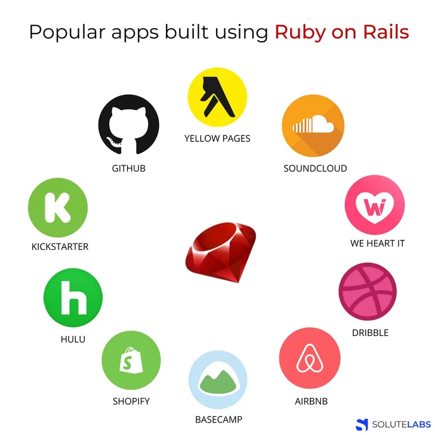
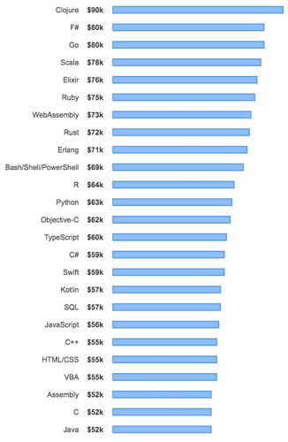

## Happiness

> I knew many languages before I created Ruby, but I was never fully satisfied with them. They were uglier, tougher, more complex, or more simple than I expected. Throughout the development of the Ruby language, I’ve focused my energies on making programming faster and easier. Ruby is designed to make programmers happy.- **Yukihiro Matsumoto (Matz)**

I have to agree with Matz that while I coding in Ruby, I feel like I'm talking to my wife - truly happy. There is an mutual understanding between us. I used to code in many other languages such as C++, PHP, Javascript and make money by them but then I can't remember what I did with my code. I don't have any feelings when I re-read my code in another raining day. In the end, they're just friends with benefits. With Ruby, it lets me feel proud of myself every time I read my own code - clean, well-structured and beautifuuuuul. Therefore, everyday I happily come to the office and enjoy with my wife there.

Ruby was inspired and influenced by several other programming languages. Lisp, Smalltalk, Perl, Eiffel, Ada, Basic, and others so I just need to marry one who own the other's perfect things

## Ruby on Rails

As usual, after marrying you don't have to make any decisions because.. you are not allowed, your wife did it for you. I don't need to think about **testing framework** because Rails has **Rspec, background job** with S**idekiq, sending email**with **Action Mailer Basics,..** I got well time when let Rails decide those for me, It’s all Ruby, and written by the clever. Furthermore, there are a lot of gems that solve many specific tasks. All that you need is to google and you’ll almost always find a ready-made solution that you’ll just need to connect and a little configure for your concrete task.

Now, your app is like a Ruby going ahead on a defined road to success.

## **Is Ruby on Rails dying?**

**1. Slow Performance**

Ruby is interpreted language, unlike compiled programming technologies like C++ so Ruby requires a little bit more extra time to execute the code. Therefore, we can say that RoR is slow at performance, but fast in terms of the MVP’s and prototypes’ development speed. There is nothing to argue about this.

I worked through some RoR projects, where people and developers coding that project are blaming on Ruby's performance and I recognized that slow performance is not only the Ruby's fault. You know what I mean.

**2. Scalability issues**

When Twitter moved out of Ruby on Rails to Scala, that is a shocking bad news with many developers who never work with Ruby on Rails. Some guys said because of scalability issues so Twitter have to switch to other language. This is spread throughout the world even thought Twitter Engineer confirmed

> The move to Scala and Java at Twitter is driven more by a need for encapsulation than for performance and scalability and much of the existing Ruby code is quite workable for the time being.

However, a real-life example shows us Shopify who is able to scale and support over 500,000 businesses at a time with Ruby on Rails.

3. **RoR & Machine Learning**

There are some kids playing with my children in the garden and they all are smarter than my kids, should I blame it on my wife (Ruby). If you want to have smart kids like Machine Learning, AI,.., you should marry with Python from the beginning. Ruby was not born for ML. In my perspective, I am happy to have many children in a short time and they're all beautiful. That's enough.

**And are they good reasons to claim Ruby old and dead?**

## The future of Ruby on Rails

New versions of Ruby is coming really near. The [update of Ruby planned for release in 2020](https://sloboda-studio.com/blog/big-news-ruby-version-3-0/) will be groundbreaking.

The creators set three goals for Ruby 3:

1. Static analysis
2. JIT / Ruby 3×3 / Performance
3. Concurrency

Ultimately, the Ruby founder wants Ruby to be at least 3x faster than the current version, to have better handling of concurrency and “duck inference” with the introduction of static types in the best way.

## Conclusion

Let's look at the average salary of Ruby developers in 2020 chart, you will see. Ruby's still in top 5 of the world in 2020

Sometimes people believe that if nobody is talking about a technology then it means that/ this technology is dying. Well, this is not the case here. It only means that the peak of Ruby on Rails’s popularity has passed and the period of stability has come.

In the end, I wish Vietnamese universities applied Ruby on Rails on Web Development courses after all. Ruby's worth learning because a good language will shape the way we think.
